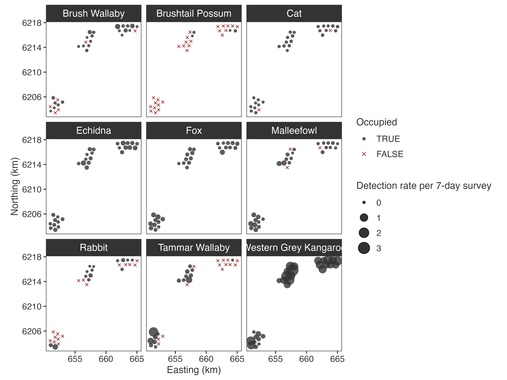
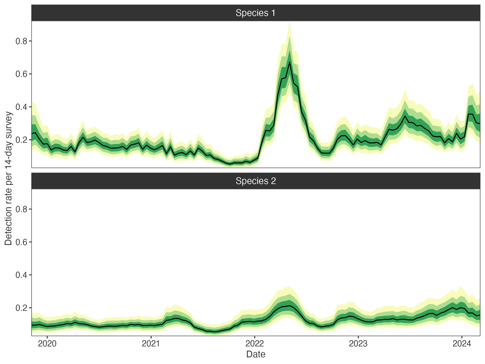
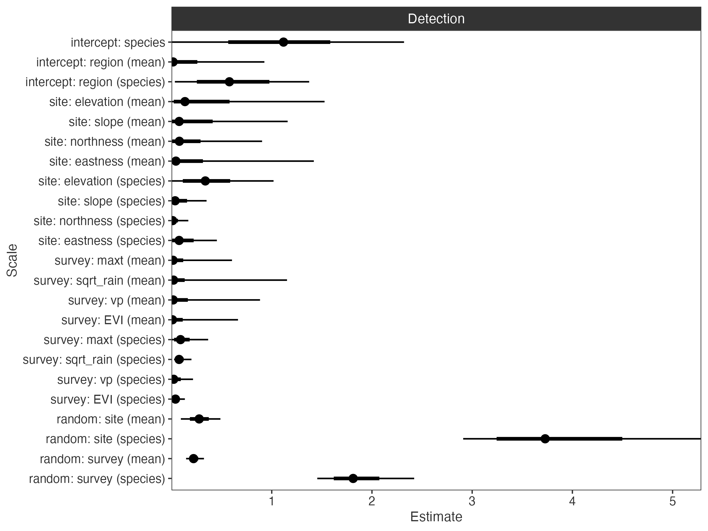

# occARU

<!-- badges: start -->
[](https://opensource.org/licenses/MIT)
[](https://lifecycle.r-lib.org/articles/stages.html#experimental)
[](https://github.com/mhollanders/occARU/actions/workflows/R-CMD-check.yaml)
<!-- badges: end -->

occARU fits Bayesian (multispecies) occupancy models with count observation 
models to autonomous recording unit (ARU) data like those derived from camera 
traps and passive acoustic monitoring. The approach differs from standard 
occupancy models in that the focus is on quantifying detection rates, rather 
than treating detection as a nuisance parameter to correct for. The 
[occARU model](https://mhollanders.github.io/occARU/articles/model.html) 
implements hierarchical species-level random effects with spatial and temporal 
Gaussian processes, variance decomposition via  global-local shrinkage priors, 
and is built on [Stan](https://mc-stan.org/) via 
[cmdstanr](https://mc-stan.org/cmdstanr/).

## Installation

Install occARU from GitHub:
```r
# install.packages("remotes")
remotes::install_github("mhollanders/occARU")
```

occARU requires CmdStan >= 2.36.0. If you have not used Stan before, run:
```r
library(occARU)
setup_occARU()
```

This checks your C++ toolchain and installs CmdStan automatically.

## Getting started

### 1. Prepare data

`make_data()` accepts deployment and observation data frames following the
[camtrapDP](https://tdwg.github.io/camtrap-dp/) format:
```r
data <- make_data(
  deployments = deployments,
  observations = observations,
  failures = failures  # also accepts failure dates per site
  survey_length = 14, # aggregate to 2-weekly survey periods
  thin_minutes = 30  # thin observations to 30 minutes, retaining highest count
  detection_site_predictors = site_predictors,
  survey_predictors = survey_predictors 
)
data
#> ── occARU data ─────────────────────────────────────────────────────
#> Sites (I): 30
#> Surveys (J): 114
#> Species (S): 6
#> Detections: 11463
#> Site coordinates: yes
#> Deployment span: 2019-11-06 to 2024-03-06
#> Survey length: 14 days
#> Thinning: 30 minutes
#> Occupancy site predictors: 0
#> Detection site predictors: 5
#>   Continuous: 3
#>   Categorical: 1
#>   Ordinal: 1
#> Survey predictors: 4
#>   Continuous: 3
#>   Categorical: 0
#>   Ordinal: 1
```

### 2. Fit a model

```r
# set some priors for hyperparameters (unspecified use defaults)
priors <- set_priors(
  psi_bar = c(1, 2),  # Beta(1, 2) for mean occupancy
  mu_W = c(3, 0, 1)   # Student-t+(3, 0, 1) for log detection variance
)
#> ── occARU priors ───────────────────────────────────────────────────────────
#> psi_bar: Beta(1, 2)
#> mu_bar: Gamma(1, 1)
#> psi_W: Student-t+(3, 0, 1)
#> mu_W: Student-t+(3, 0, 1)
#> psi_theta: Gamma(1, 1)
#> ...

# fit the model
fit <- fit_model(data, prior = priors)
```

By default this fits a model with spatial and temporal Gaussian processes,
Dirichlet variance decomposition, and Poisson observation model, initialised
with [Pathfinder](https://mc-stan.org/docs/reference-manual/pathfinder.html)
across 4 chains. See `?fit_model` and `?set_priors` to customise the model 
structure and priors.

### 3. Check some output

```r
# site occupancy and detection rates
plot_sites(fit)
```



```r
# temporal detection trends
plot_surveys(fit, species = c("Species 1", "Species 2"))
```



Key design choices in occARU are hierarchical multispecies spatial and temporal 
Gaussian processes, implemented with orthogonal projection to retain fixed 
effects. Interspecific correlations are estimated for responses to predictors 
and random effects to explore species interactions.

```r
# variance partitions
plot_partitions(fit, scales = TRUE)
```



Global-local shrinkage priors are used to handle model complexity through
variance decomposition of the occupancy and detection linear predictors.

### 4. Interrogate

```r
# use PSIS-LOO-CV on the site-by-species level log likelihood
fit$loo("log_lik2")  # log_lik2 uses Monte Carlo integration of random effects

# check prior sensitivity using power-scaling
priorsense::powerscale_plot_dens(fit$draws("log_lik", "lprior", "psi_bar"))

# posterior predictive checking of aggregated site-by-species counts
bayesplot::pp_check(apply(data$y, c(1, 3), sum) |> c(),
                    yrep = fit$draws("Qrep", format = "draws_matrix"),
                    group = rep(attr(data, "species"), each = data$I),
                    fun = "ppc_rootogram_grouped")
```

The model stores marginal site-by-species log likelihoods (`log_lik`), the log
prior density (`lprior`), and posterior predictions for the full detection
history (`yrep`) or aggregated site-by-species counts (`Qrep`). Optionally,
Monte Carlo integration over site and observation-level random effects produces
marginal log likelihoods (`log_lik2`) with improved PSIS-LOO-CV performance.

## Learn more

- `vignette("model")`
- `?make_data`, `?fit_model`, `?set_priors`
